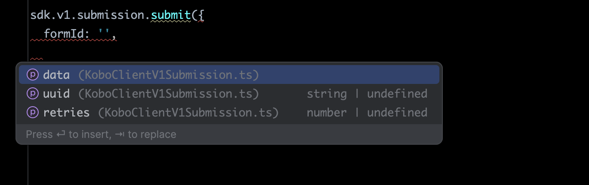
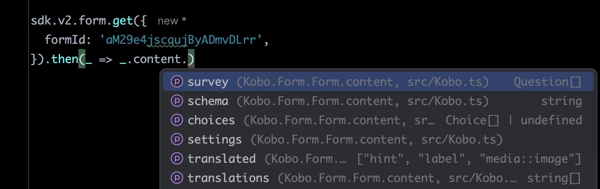

# Kobo-SDK 

A TypeScript SDK for interacting with the [KoboToolbox](https://www.kobotoolbox.org/) API. This library simplifies
authentication, data retrieval, and
form management, making it easier to work with KoboToolbox in Node.js and browser environments.
**Optimized for TypeScript, with full type definitions.**

## Table of Contents

- [Installation](#installation)
- [Usage](#usage)
    - [Initialization](#initialization)
    - [Constructor parameters](#constructor-parameters)
    - [Kobo servers index](#kobo-servers-index)
    - [Insert new submission](#insert-new-submission)
    - [Update submissions](#update-submissions)
    - [Fetch submissions](#fetch-submissions)
- [Under-the-Hood Features Summary](#under-the-hood-features-summary)
    - [Submission](#submission)
    - [Update](#update)
    - [Fetching](#fetching)
- [TypeScript support](#typeScript-support)
- [Contributing](#contributing)

## Installation

```npm install kobo-sdk```

## Usage

### Initialization

```ts
import {KoboClient} from 'kobo-sdk'

const sdk = new KoboClient({
  urlv1: 'https://kc.kobotoolbox.org',
  urlv2: 'https://kf.kobotoolbox.org',
  token: '<YOUR PRIVATE TOKEN>',
})
```

### Constructor Parameters

| Parameter        | Required | Description                                                                                                                                                   |
|------------------|----------|---------------------------------------------------------------------------------------------------------------------------------------------------------------|
| `urlv1`          | ✅        | Alias `kc_url`. KoboToolbox provides two API versions; this one is specifically used for submitting data to a form, as there is no equivalent endpoint in v2. |
| `urlv2`          | ✅        | Alias `kf_url`.                                                                                                                                               |
| `token`          | ✅        | Private API token, available in your KoboToolbox account settings.                                                                                            |
| `ApiClientClass` | ❌        | Uses Axios by default. This parameter allows for a custom HTTP client.                                                                                        |
| `log`            | ❌        | Logs output to the console by default.                                                                                                                        |

### Kobo Servers Index

| Server | V1 (kc)                       | V2 (kf)                    |
|--------|-------------------------------|----------------------------|
| EU     | https://kc-eu.kobotoolbox.org | https://eu.kobotoolbox.org |
| Global | https://kc.kobotoolbox.org    | https://kf.kobotoolbox.org |
| DRC    | https://kc-kobo.drc.ngo       | https://kobo.drc.ngo/      |

### Insert New Submission

**Only the question name** (without the `begin_group` path) is used as a key when submitting data.  
The Kobo API expects grouped questions in a nested structure, but **this function automatically handles the formatting**.  
If submission fails, it retries up to 5 times by default, which can be adjusted using the `retries` parameter.

```ts
await sdk.v1.submission.submitXml({
  formId: 'aM29e4jscqujByADmvDLrr',
  data: {
    question_name_type_text: 'answer',
    question_name_type_integer_variant1: 1,
    question_name_type_integer_variant2: '1',
    question_name_type_select_multiple: 'option1 option2',
    question_name_type_select_one: 'option1',
    question_name_begin_repeat: [
      {question_name: 'answer1'},
      {
        question_name: 'answer2',
        question_name_nested_repeat: [{question_name: 'answer'}],
      },
    ],
  },
})
```

### Update Submissions

**Only the question name** (without the `begin_group` path) is used as a key when submitting data.
The Kobo API expects `$xpath` as a key, including `begin_group`s but **this function automatically handles the formatting**.

**Note:**

- The Kobo API fails if it receives too many updates in a short time **BUT**
  This function automatically splits requests into smaller chunks and queues calls, ensuring updates are throttled at a
  pace the Kobo API can handle.

- If submission fails, it retries up to 8 times by default, which can be adjusted using the `retries` parameter.

```ts
await sdk.v2.submission.update({
  formId: 'aM29e4jscqujByADmvDLrr',
  submissionIds: ['1', '2'],
  data: {
    question_name_type_text: 'New answer',
    question_name_type_select_multiple: 'option1 option2 option3',
  },
})
```

### Fetch Submissions

Supports filtering `_submission_time` by range, limit, and offset.  
The Kobo API limits responses to 30,000 submissions per request to prevent timeouts, **but** this function automatically
splits API calls into chunks and merges results, allowing retrieval of any number of submissions seamlessly.

```ts
sdk.v2.submission.get({
  formId: 'aM29e4jscqujByADmvDLrr',
  filters: {
    start: new Date(2024, 0, 1),
    end: new Date(2024, 0, 1),
    offset: 10,
    limit: 5e4,
  }
})
```

The function removes paths from keys and extracts answers from metadata.
To retrieve the raw API response, use `sdk.v2.submission.getRaw` instead.

## Under-the-Hood Features Summary

### **Submission**

- Implemented the `/v1/submission.xml` endpoint, as JSON submissions cause bugs.
- Automatically retrieves `formhub/uuid`.
- Generates `instanceID`.
- Formats the request body to match Kobo's complex nested structure.
- Supports automatic retries.

### **Update**

- Controls update pacing to prevent server rejection.
- Formats the request body using `$xpath` as keys.

### **Fetching**

- Manages data reconciliation when fetching over 30,000 submissions.
- Provides a simple API for `start` and `end` query parameters.

## TypeScript Support

We strongly recommend using this **SDK** with **TypeScript** for full type support and preventing you from pulling your
hair out.




## Contributing

Contributions are welcome! Feel free to submit a PR or open an issue.
